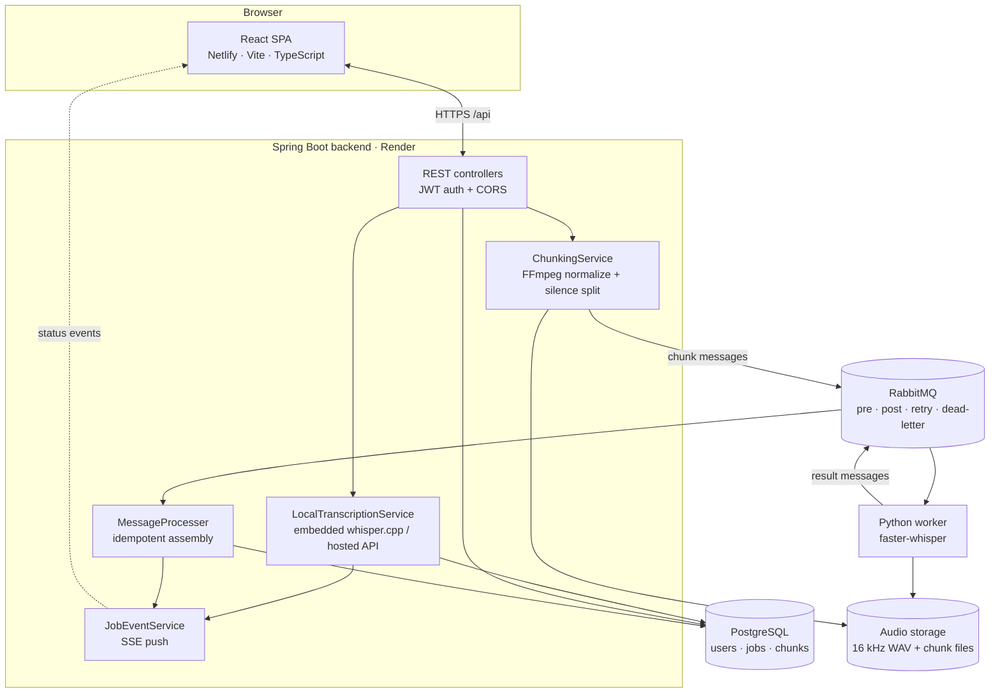
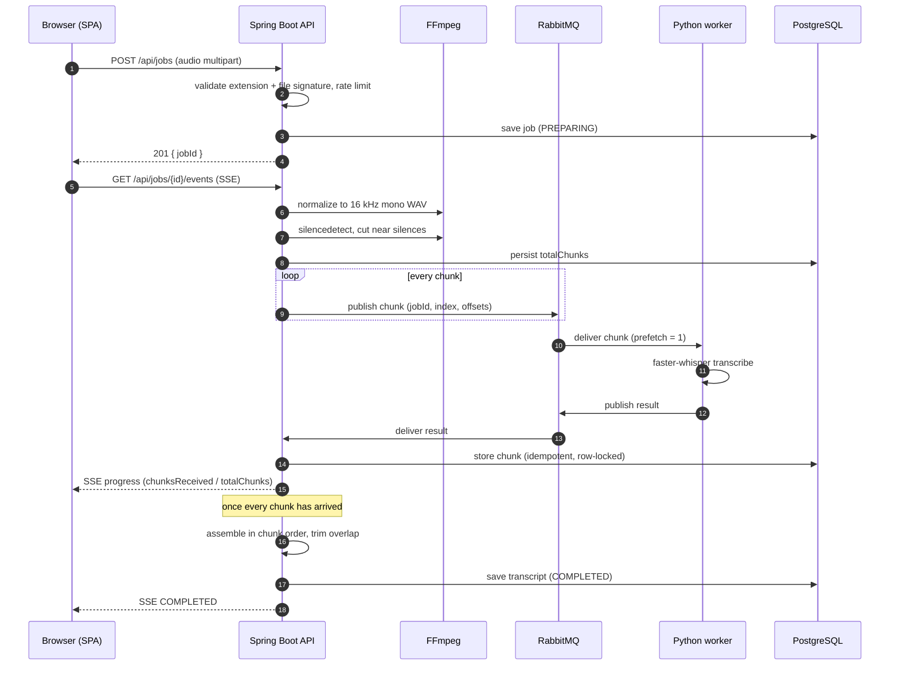
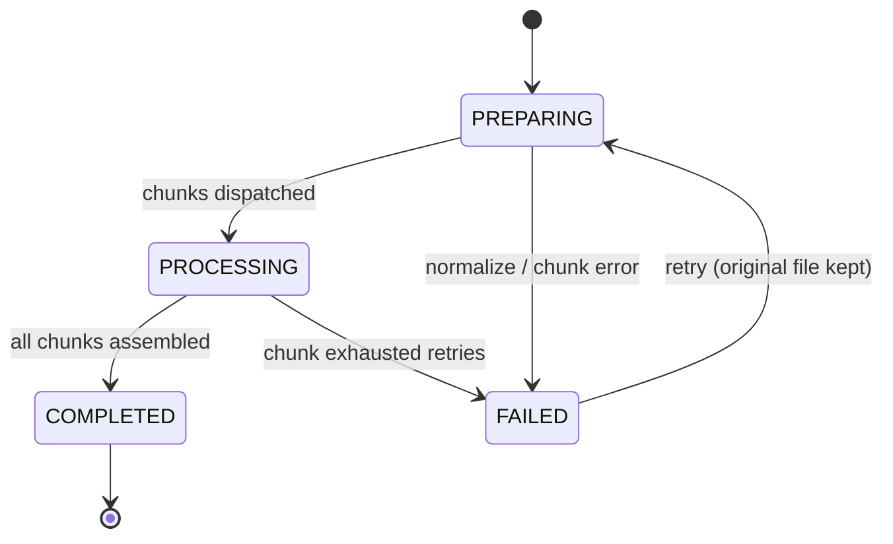

# Wave Parser

Wave Parser turns audio into accurate, timestamped transcripts. Upload a file and the
API returns a job id immediately; transcription happens asynchronously, progress streams
back to the browser over Server-Sent Events (SSE), and the finished transcript can be
searched, corrected, and exported as `txt`, `srt`, `vtt` or `json`.

The project is a full-stack demonstration of an asynchronous, queue-driven pipeline:
a Spring Boot API orchestrates the work, a Python worker runs a local Whisper model,
and a React SPA presents the results.

## Live deployment

| | URL |
| --- | --- |
| Web app | <https://24eg107d10.netlify.app> |
| API | <https://wave-parser-backend.onrender.com> |
| API docs (Swagger UI) | <https://wave-parser-backend.onrender.com/swagger-ui.html> |
| Health check | <https://wave-parser-backend.onrender.com/actuator/health> |

The frontend is hosted on **Netlify**; the backend runs on **Render**. The app is no
longer self-hosted — the links above are the canonical deployment. Render's free tier
sleeps after ~15 minutes idle, so the first request may take 30–60 seconds to wake up.

---

## Architecture

Wave Parser has three runtime roles — an API/orchestrator, a transcription worker, and a
single-page client — glued together by a broker and two pieces of shared state.



### Component responsibilities

| Component | Tech | Responsibility |
| --- | --- | --- |
| **Frontend** | React 19, Vite, TypeScript, React Router | Upload with progress, job history, live progress, transcript viewer/editor, search, export, auth |
| **Backend** | Spring Boot 4, Java 21 | Upload validation, JWT auth, FFmpeg chunking, job lifecycle, transcript assembly, SSE, exports |
| **Worker** | Python 3.11, faster-whisper, pika | Consumes chunk messages, transcribes, publishes results |
| **Broker** | RabbitMQ 3 | Chunk work queue, result queue, TTL retry queue, dead-letter queue |
| **Database** | PostgreSQL 16 | Users, jobs, and per-chunk results |
| **Storage** | Filesystem volume | Normalized audio and chunk files (shared by backend + worker in queue mode) |

### Two transcription modes

The backend can produce transcripts in two ways, selected by `TRANSCRIPTION_MODE`:

- **`queue`** (default) — the full asynchronous pipeline. The backend chunks audio and
  publishes it to RabbitMQ; one or more Python workers transcribe in parallel; results
  flow back and are assembled. This is the scalable path and the one shown below.
- **`whispercpp` / `api`** — no broker or worker required. The backend transcribes the
  whole file in-process using an embedded `whisper.cpp` binary, or by calling a hosted
  OpenAI-compatible transcription API (e.g. Groq). This is the light path used on
  constrained/free hosting where running a worker is impractical.

Both modes drive the same `PREPARING → PROCESSING → COMPLETED` state machine that the
frontend already understands, so no UI changes are needed when switching.

### How a job flows (queue mode)



Key reliability details:

1. **Immediate return.** The upload is validated and stored, then returns a `jobId`.
   Normalizing and splitting run off the request thread on a bounded executor.
2. **Silence-aware chunking.** FFmpeg normalizes to 16 kHz mono WAV, detects silences,
   and prefers to cut at silence midpoints near the target chunk length. Chunks overlap
   by a small amount so no word is sliced in half.
3. **Retry with backoff, then dead-letter.** A failed chunk is republished through a TTL
   retry queue (15 s delay) up to `CHUNK_MAX_ATTEMPTS`; messages that exhaust retries go
   to the dead-letter queue and the job is marked `FAILED`.
4. **Idempotent assembly.** A redelivered chunk is ignored. The job row is loaded with a
   write lock, so concurrent results assemble safely. Overlap between adjacent chunks is
   trimmed to avoid duplicated text.
5. **Live updates.** Every state change is published to `JobEventService` and pushed to
   the subscriber over SSE. The frontend also falls back to polling on reconnect.

### Job state machine



A watchdog fails jobs stuck in `PROCESSING` for longer than `APP_JOB_TIMEOUT_MINUTES`
so a lost worker can never hang a job forever. A nightly scheduler deletes audio and
rows older than the retention window.

---

## Tech stack

| Layer | Stack |
| --- | --- |
| Frontend | React 19, React Router 7, TypeScript, Vite |
| Backend | Spring Boot 4.1, Java 21, Spring Security (JWT), Spring Data JPA, Spring AMQP |
| Transcription | faster-whisper (Python worker) **or** whisper.cpp / OpenAI-compatible API (in-process) |
| Media | FFmpeg / ffprobe |
| Data | PostgreSQL 16, RabbitMQ 3 |
| API docs | springdoc-openapi (Swagger UI) |
| Packaging | Docker & Docker Compose |

---

## Repository layout

```
bee/
├── backend/        Spring Boot API (Java 21, Maven)
├── frontend/       React SPA (Vite, TypeScript, nginx config)
├── whisper/        Python transcription worker (faster-whisper)
├── docker-compose.yml        Full local stack (postgres, rabbitmq, backend, worker, web)
├── .env.example              Every supported environment variable
├── DEPLOYMENT_RENDER_NETLIFY.md   Production deployment walkthrough
└── DEMO_CHANGES.md           How the in-process (no-worker) mode was added
```

---

## API

All endpoints live under `/api` and require a JWT, except registration, login, and the
public health/docs routes.

| Method | Path | Purpose |
| --- | --- | --- |
| `POST` | `/api/auth/register`, `/api/auth/login` | Register / log in, returns a JWT |
| `POST` | `/api/jobs` | Upload audio, returns a job id |
| `GET` | `/api/jobs` | Job history for the signed-in user |
| `GET` | `/api/jobs/{id}` | Status and chunk progress |
| `GET` | `/api/jobs/{id}/events` | Live status over SSE |
| `GET` | `/api/jobs/{id}/transcript` | Full transcript with segments |
| `PUT` | `/api/jobs/{id}/transcript` | Save manual corrections |
| `GET` | `/api/jobs/{id}/search?q=` | Phrase search with timestamps |
| `GET` | `/api/jobs/{id}/audio` | Original audio (supports HTTP Range for seeking) |
| `GET` | `/api/jobs/{id}/export?format=` | `txt`, `srt`, `vtt` or `json` |
| `POST` | `/api/jobs/{id}/retry` | Re-run a failed job |
| `DELETE` | `/api/jobs/{id}` | Delete a job, its chunks and its audio |

`GET /actuator/health` backs the Docker/Render health checks.

Because `<audio>` tags and `EventSource` cannot set request headers, those two endpoints
also accept the token as `?token=`.

---

## Running locally

The full queue-based pipeline runs with Docker Compose:

```bash
cp .env.example .env          # set JWT_SECRET at minimum
docker compose up --build     # starts postgres, rabbitmq, backend, worker, web
```

Then open <http://localhost:8080>. RabbitMQ's management UI is on
<http://localhost:15673> and Swagger UI on
<http://localhost:8080/swagger-ui.html>.

To run the services individually:

```bash
# Postgres + RabbitMQ only
docker compose up -d postgres rabbitmq

# Backend (needs FFmpeg installed)
cd backend && ./mvnw spring-boot:run

# Worker
cd whisper && uv sync && uv run whisper

# Frontend (dev server proxies /api to :8080)
cd frontend && npm install && npm run dev
```

For a broker-free local run, set `TRANSCRIPTION_MODE=whispercpp` (or `api` with a Groq
key) and start only Postgres and the backend.

---

## Configuration

Everything is environment-driven; `.env.example` lists the full set. Notable knobs:

| Variable | Default | Meaning |
| --- | --- | --- |
| `TRANSCRIPTION_MODE` | `queue` | `queue`, `whispercpp`, or `api` |
| `TRANSCRIPTION_FALLBACK_TO_API` | `false` | Retry via hosted API if the local engine fails |
| `WHISPER_MODEL_SIZE` | `base` | `tiny` … `medium`; quality vs speed (worker) |
| `APP_CHUNK_TARGET_SECONDS` | `600` | Preferred chunk length before silence snapping |
| `APP_CHUNK_SILENCE_NOISE_DB` | `-35` | Silence threshold used when splitting |
| `APP_STORAGE_RETENTION_DAYS` | `7` | Old audio is deleted after this |
| `APP_RATE_LIMIT_UPLOADS_PER_MINUTE` | `10` | Per-user upload rate limit |
| `APP_RATE_LIMIT_MAX_ACTIVE_JOBS` | `3` | Cap on jobs running at once per user |
| `CHUNK_MAX_ATTEMPTS` | `3` | Retries before a chunk is dead-lettered |
| `JWT_SECRET` | _dev only_ | **Required** in production (`openssl rand -base64 48`) |
| `ALLOWED_ORIGINS` | localhost + `*.netlify.app` | CORS allow-list for the frontend |

---

## Deployment

The hosted stack is **Netlify (frontend) + Render (backend + PostgreSQL)**. The full,
step-by-step walkthrough lives in [DEPLOYMENT_RENDER_NETLIFY.md](DEPLOYMENT_RENDER_NETLIFY.md);
the short version:

1. **Backend (Render):** a Docker web service built from `backend/Dockerfile`. Set
   `SPRING_DATASOURCE_*`, `JWT_SECRET`, and `ALLOWED_ORIGINS` to the Netlify origin.
2. **Frontend (Netlify):** build `frontend/` and publish `dist/`, with
   `VITE_API_BASE_URL=https://wave-parser-backend.onrender.com`.
3. **(Optional) Worker:** for the queue path, run `whisper/` against a broker
   (e.g. CloudAMQP). Without it, use `whispercpp` or `api` mode.

Secrets are never committed; all of the above are configured through environment
variables in the Render/Netlify dashboards.

---

## Design notes and trade-offs

- **Schema is managed by Hibernate** (`ddl-auto=update`) rather than Flyway. Moving to
  versioned migrations with a baseline is the natural next step for production.
- **Rate limiting is in-memory**, which is correct for a single backend instance; it
  would move to Redis if the backend were scaled out.
- **The worker and backend share a filesystem** in queue mode, because chunk messages
  carry a local file path. On hosts without a shared disk, use the in-process modes.
- **Speaker diarization** and a **metrics dashboard** are intentionally out of scope.
- **The whisper.cpp tiny model** trades some accuracy for a small footprint; the worker
  path supports larger `base`/`small`/`medium` models for better quality.
